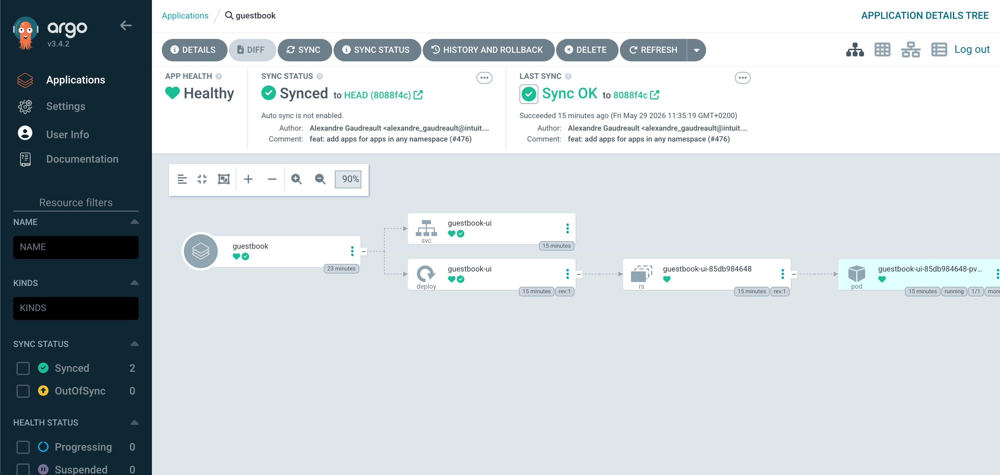

# Argo CD

Argo CD is the bundled GitOps controller. In the provided environment it is enabled by default, so a normal `terragrunt run --all apply` installs the Argo CD chart and exposes it through a Traefik `Ingress` with a Let's Encrypt certificate.



## Configure or disable it

Argo CD is configured from `infra/<env>/env.hcl`. That is where you control whether it is enabled, which hostname it uses, and which chart version is installed.

To skip Argo CD in a new environment, set its `enabled` flag to `false` before the first apply:

```hcl
argocd = {
  enabled = false
}
```

If Argo CD is already installed, destroy the `argocd` unit before flipping the flag. Once `enabled = false`, Terragrunt excludes that unit from future runs.

!!! warning
    Destroying the `argocd` unit deletes the Argo CD namespace and everything in it: registered repos, applications, projects, and accounts. The cluster keeps running, but anything Argo CD was syncing stops being reconciled.

## Access the UI

The UI is exposed through Traefik at the Argo CD host configured in `env.hcl`.

The default user is `admin`. The initial password is generated by the chart on first install and stored in the `argocd-initial-admin-secret` Kubernetes Secret:

```bash
kubectl -n argocd get secret argocd-initial-admin-secret \
  -o jsonpath='{.data.password}' | base64 -d; echo
```

After the first login, rotate the password from the Argo CD UI (User Info → Update password).

!!! tip "The initial admin secret is removed after first password rotation"
    Argo CD deletes `argocd-initial-admin-secret` once you change the admin password through the UI. Save the rotated password somewhere durable before doing that.

## Argo CD CLI

The CLI is optional but useful for scripting and for managing accounts/projects.

```bash
brew install argocd
argocd login argocd.<your-domain>
```

The CLI uses the same admin password as the UI. For service accounts or CI integration, create a dedicated Argo CD local user and issue a token; see the [upstream user management docs](https://argo-cd.readthedocs.io/en/stable/operator-manual/user-management/).

## Add your first Application

The fastest way to see Argo CD do something is the canonical guestbook sample. After `argocd login`, create the Application from the CLI:

```bash
argocd app create guestbook \
  --repo https://github.com/argoproj/argocd-example-apps.git \
  --path guestbook \
  --dest-server https://kubernetes.default.svc \
  --dest-namespace default
```

Sync it, then check the result in the cluster:

```bash
argocd app sync guestbook
argocd app get guestbook
kubectl -n default get pods,svc -l app=guestbook-ui
```

The Application now appears in the Argo CD UI and reconciles whenever the upstream repo changes.

### Declarative equivalent

Imperative `argocd app create` is fine for poking around, but real GitOps puts the `Application` itself in a Git repo so Argo CD reconciles it the same way as anything else. The equivalent declarative manifest for the same guestbook sample:

```yaml
apiVersion: argoproj.io/v1alpha1
kind: Application
metadata:
  name: guestbook
  namespace: argocd
spec:
  project: default
  source:
    repoURL: https://github.com/argoproj/argocd-example-apps.git
    targetRevision: HEAD
    path: guestbook
  destination:
    server: https://kubernetes.default.svc
    namespace: default
  syncPolicy:
    automated:
      prune: true
      selfHeal: true
    syncOptions:
      - CreateNamespace=true
```

Apply it with `kubectl -n argocd apply -f app.yaml`, or commit it to a repo Argo CD is already watching (the "app-of-apps" pattern). The [upstream getting started guide](https://argo-cd.readthedocs.io/en/stable/getting_started/) covers private repos, Helm value overrides, and ApplicationSets.

## Resource expectations

Argo CD is comfortable on small Hetzner nodes. The repo-server and application-controller are the heaviest components and grow with the number of tracked Applications and repos.

If `argocd-application-controller` pods start getting OOMKilled with many Applications, first add worker capacity in `agent_nodepools` before tuning Helm resource values blind.
