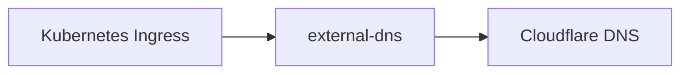

# (deprecated) Cloudflare DNS

The `cloudflare-dns` unit was the DNS mechanism in v0.1.0. It created Cloudflare `A` records directly from Terraform, using hostnames from `env.hcl` and worker node public IPs from the `cluster` unit.

In v0.2.0, active DNS management moved to [ExternalDNS](external-dns.md). ExternalDNS watches Kubernetes `Ingress` objects and reconciles Cloudflare records from the hostnames and status IPs Kubernetes publishes.

!!! warning "Use ExternalDNS for v0.2.0 and newer"
    This page is kept for readers upgrading from v0.1.0 or reading old state. New hostnames should be configured with Kubernetes `Ingress` objects, not with `cloudflare-dns`.

## What this unit did in v0.1.0

The v0.1.0 `cloudflare-dns` unit:

- read the Cloudflare API token from R2;
- read the Cloudflare zone and base domain from `infra/<env>/env.hcl`;
- read worker node public IPs from the `cluster` unit;
- created unproxied Cloudflare `A` records for bundled service hostnames;
- expanded `cloudflare.additional_ingress_subdomains` into extra records under the base domain.

Together with Klipper exposing Traefik on each worker, those records gave simple DNS round-robin without a paid load balancer.

## What changed in v0.2.0

The `cloudflare-dns` unit still exists in v0.2.0, but only as a decommissioning unit. Its module no longer declares DNS records. During a normal `terragrunt run --all apply`, Terraform sees that the old records are gone from configuration and destroys the records it created in v0.1.0.

The unit is kept for one release so upgrades can clean up state instead of orphaning it. A later release can remove the unit once users have had a chance to apply v0.2.0.

The new path is:



See [ExternalDNS](external-dns.md) for the active v0.2.0 DNS model.

## `additional_ingress_subdomains`

In v0.1.0, this setting created extra Terraform-managed DNS records:

```hcl
cloudflare = {
  zone_id = "<cloudflare-zone-id>"
  domain  = "<example.com>"

  additional_ingress_subdomains = [
    "app",
    "api",
  ]
}
```

In v0.2.0, it no longer drives DNS. Set it to an empty array if it still exists in your environment file:

```hcl
cloudflare = {
  zone_id = "<cloudflare-zone-id>"
  domain  = "<example.com>"

  additional_ingress_subdomains = []
}
```

Then configure each extra hostname on the Kubernetes `Ingress` for that app. ExternalDNS will create the matching Cloudflare record from the Ingress.

## Upgrade note

Upgrading from v0.1.0 to v0.2.0 is meant to happen through the normal full apply:

```bash
cd infra/<env>
terragrunt run --all apply
```

During that apply, ExternalDNS is installed and the old Terraform-managed records are removed. A short DNS interruption of less than one minute is expected while Cloudflare records created by `cloudflare-dns` are deleted and ExternalDNS reconciles its own records.

For the full release note and upgrade checklist, see [Changelog and upgrades](changelog.md).
