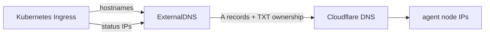

# ExternalDNS

The `external-dns` unit installs [ExternalDNS](https://kubernetes-sigs.github.io/external-dns/) into the cluster and preconfigures it for Cloudflare. Instead of Terraform creating DNS records from `env.hcl`, ExternalDNS watches Kubernetes `Ingress` objects and keeps Cloudflare records in sync with the addresses Kubernetes publishes for those Ingresses.

That means DNS follows the same source of truth as traffic routing: if a hostname should receive traffic, it belongs on an `Ingress`.

For the full request path from browser to pod, see [Bundled ingress](ingress.md).

## How it works

The module creates:

- a Kubernetes namespace for ExternalDNS;
- a Kubernetes Secret containing `cloudflare_api_token` from `secrets.json` in R2;
- an ExternalDNS Helm release configured for the Cloudflare provider.

ExternalDNS is scoped to the environment's Cloudflare zone with `domainFilters` and `--zone-id-filter`. It also uses a TXT registry with `txtOwnerId = cluster_name`, so this cluster only reconciles records it owns and can share a zone with other clusters or environments.

The important behavior is:



Records are created after the `Ingress` exists and Kubernetes has published its load balancer addresses. ExternalDNS reconciles continuously, roughly once per minute, so changes usually appear shortly after the Ingress changes.

## Configure

The relevant settings in `infra/<env>/env.hcl`:

```hcl
cloudflare = {
  zone_id = "<cloudflare-zone-id>"
  domain  = "<example.com>"
}

external_dns = {
  enabled       = true
  chart_version = "<external-dns-chart-version>"
  namespace     = "external-dns"
}
```

| Setting | What it controls |
| --- | --- |
| `cloudflare.zone_id` | The Cloudflare zone ExternalDNS is allowed to manage. |
| `cloudflare.domain` | Domain filter for records this environment can reconcile. |
| `external_dns.enabled` | Whether the ExternalDNS unit is included in Terragrunt runs. |
| `external_dns.chart_version` | Helm chart version for the ExternalDNS release. |
| `external_dns.namespace` | Namespace where ExternalDNS runs. |

Hostnames for bundled services (`argocd.host`, `signoz.host`, `harbor.host`) still live in their per-service blocks. Those modules create Ingresses, and ExternalDNS creates the matching Cloudflare records from those Ingresses.

## Adding an app hostname

Create a normal Kubernetes `Ingress` for the hostname you want. ExternalDNS sees the Ingress and creates the Cloudflare record for it.

For example, an app using `app.example.com` should have that hostname in `spec.rules[].host` and, when TLS is enabled, in `spec.tls[].hosts`:

```yaml
apiVersion: networking.k8s.io/v1
kind: Ingress
metadata:
  name: app
  namespace: app
  annotations:
    cert-manager.io/cluster-issuer: letsencrypt-prod
spec:
  ingressClassName: traefik
  rules:
    - host: app.example.com
      http:
        paths:
          - path: /
            pathType: Prefix
            backend:
              service:
                name: app
                port:
                  number: 80
  tls:
    - hosts:
        - app.example.com
      secretName: app-tls
```

Your application `Deployment`, `Service`, and `Ingress` can live in Kubernetes directly or in whatever Argo CD syncs. ExternalDNS only handles the DNS records.

!!! warning "`additional_ingress_subdomains` is no longer used"
    In v0.2.0, extra app hostnames are configured with Ingresses, not with `cloudflare.additional_ingress_subdomains`. Set `additional_ingress_subdomains = []` if the setting still exists in your environment file, then put each hostname on the relevant Ingress.

## Agent node IPs only

The example environment labels agent node pools with `svccontroller.k3s.cattle.io/enablelb=true`. That puts Klipper in allow-list mode, so Traefik is exposed on agent nodes and the control-plane IP is kept out of Ingress status.

ExternalDNS publishes records from Ingress status, so this label is what makes DNS resolve to agent pool IPs only.

If you add another agent pool that should receive ingress traffic, give that pool the same label. If you add a node pool that should not receive public ingress traffic, leave the label off.

## Round-robin behavior

For unproxied records, Cloudflare returns every `A` record for the hostname in [rotating order](https://developers.cloudflare.com/dns/manage-dns-records/how-to/round-robin-dns/). Clients that always try the first answer therefore spread roughly evenly across agents over time.

This is simple load sharing, not a managed load balancer:

- DNS and client caches can make traffic uneven.
- Plain round-robin does not health-check agents, so a wedged node can keep getting traffic until DNS caches expire.
- For real load balancing with health checks, switch to a Hetzner Load Balancer or front the agent IPs with Cloudflare's Load Balancing product. Both cost more than the default setup.

## Proxy mode

Records are managed with Cloudflare proxying disabled.

!!! danger "Do not enable Cloudflare proxy"
    cert-manager currently uses HTTP-01, and those challenges need to reach Traefik directly. Flipping proxy mode on breaks certificate issuance and renewal. Only enable proxy mode if you also switch the ACME solver to something compatible, such as DNS-01.

See [ACME (Let's Encrypt)](acme.md) for the certificate flow and [Bundled ingress](ingress.md) for the full traffic path.

## Token scope

The Cloudflare API token in R2 needs `DNS:Read` and `DNS:Write` on the zone (`cloudflare.zone_id`) this environment manages. It does not need account-level permissions, and it should not be the global API key.

If the token has the wrong scope, ExternalDNS starts but cannot reconcile records. Rotate the token via the Cloudflare UI, update `secrets.json` in R2 with `secrets-edit.sh`, and re-run apply.
