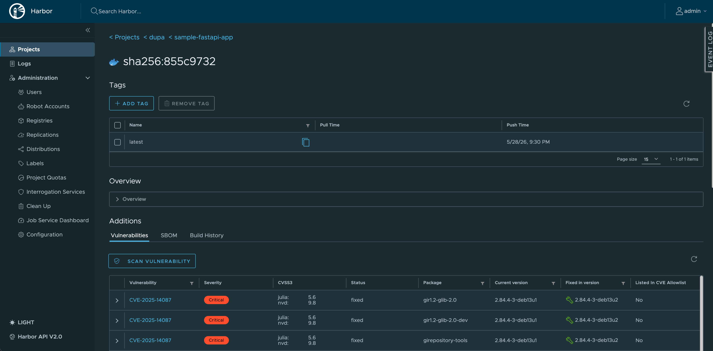

# Harbor

Harbor is the bundled container registry. It runs alongside [Trivy](https://github.com/aquasecurity/trivy) for image vulnerability scanning. In the provided environment it is enabled by default, so a normal `terragrunt run --all apply` installs the Harbor chart, a Traefik Ingress, and the bundled Postgres and Redis.



## Configure or disable it

Harbor is configured from `infra/<env>/env.hcl`. That is where you control whether it is enabled, which hostname it uses, the chart version, and the size of its persistent volumes.

To skip Harbor in a new environment, set the Harbor `enabled` flag to `false` before the first apply:

```hcl
harbor = {
  enabled = false
}
```

If Harbor is already installed, destroy the `harbor` unit before flipping the flag. Once `enabled = false`, Terragrunt excludes that unit from future runs.

!!! warning
    Destroying the `harbor` unit deletes the Harbor namespace and its five [persistent volumes](persistent-volumes.md). Any pushed images, Helm charts, vulnerability databases, and bundled Postgres/Redis state are lost unless you have backed them up elsewhere.

## Tune chart values

Use `helm_set` in the Harbor block in `infra/<env>/env.hcl` for chart values
that the module does not expose directly. Use `helm_set_sensitive` for values
that must stay out of plan and apply output.

See [Helm value overrides](helm-values.md) for examples, limits, and the required
git hook.

## Resize the persistent volumes

Harbor's chart keeps state on five PersistentVolumeClaims. Their sizes are exposed in `infra/<env>/env.hcl` so each environment can tune capacity without forking the module.

| PVC | Purpose |
| --- | --- |
| `registry` | Image and chart blobs. The only PVC that grows with usage. |
| `jobservice` | Async job logs (replication, GC, scans). |
| `database` | Bundled Postgres data for the Harbor core. |
| `redis` | Bundled Redis (jobservice queues, registry cache). |
| `trivy` | Trivy vulnerability database cache. |

Hetzner block storage is grow-only, so it is safer to start a little small than to oversize on day one. See [Persistent Volumes](persistent-volumes.md) for the storage class details and operational caveats.

## Access the UI

The UI is exposed through Traefik at the Harbor host configured in `env.hcl`.

The username is `admin`. The initial password is generated during apply and stored in the `harbor-admin-secret` Kubernetes Secret:

```bash
kubectl -n harbor get secret harbor-admin-secret \
  -o jsonpath='{.data.HARBOR_ADMIN_PASSWORD}' | base64 -d; echo
```

After the first login, the password can be rotated from the Harbor UI. The chart keeps reading the existing secret, so future applies are not affected.

## Push and pull images

Log in once per workstation with the Harbor hostname:

```bash
docker login harbor.<your-domain>
```

Then tag and push images into a Harbor project (the default `library` project is created automatically; new projects can be added from the UI):

```bash
docker tag my-app:dev harbor.<your-domain>/library/my-app:dev
docker push harbor.<your-domain>/library/my-app:dev
```

Pulling from inside the cluster uses the same hostname. Private projects need an `imagePullSecret` on the workload; the [Harbor docs](https://goharbor.io/docs/) cover the standard patterns.

## Image scanning with Trivy

Trivy is enabled by default. Each project can opt into automatic scans on push, and a manual scan can be triggered from the UI for any pushed image.

The Trivy vulnerability database lives on the `trivy` PVC and refreshes itself periodically; the first scan after a fresh install may take a few minutes while the database downloads.

## Resource expectations

Harbor is useful, but it is not tiny. The chart runs six core components plus a bundled Postgres and Redis. On small Hetzner nodes such as `cx22` or `cx23` the core, registry, and Postgres can be the heaviest.

If Harbor pods start getting OOMKilled, first consider adding worker capacity in `agent_nodepools` for that environment. Tune Helm resource values only once you know which component is actually constrained.
