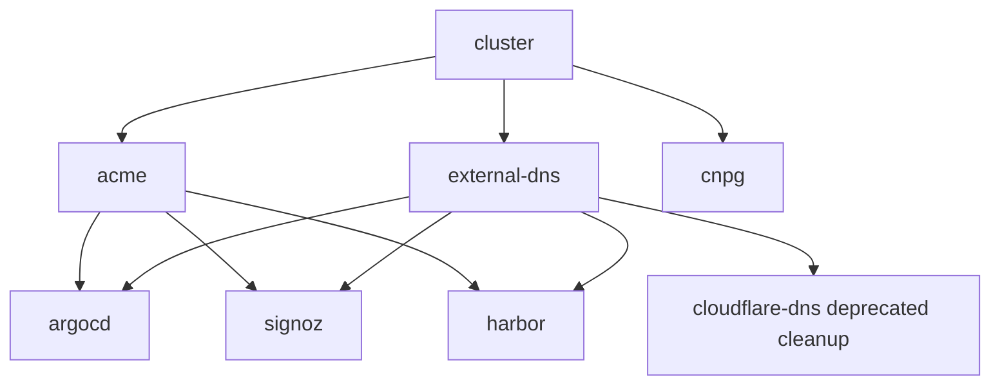

# How it fits together

This project is a small stack of Terraform modules, wired together by Terragrunt. The goal is that one environment folder, such as `infra/dev`, can describe a whole Kubernetes platform: Hetzner servers, k3s, ingress, TLS, DNS, GitOps, observability, and etc.

The short version:

- Git stores the Terraform modules, Terragrunt wiring, and non-secret environment settings.
- Cloudflare R2 stores Terraform state, `secrets.json`, and the rendered kubeconfig.
- Terragrunt reads the environment folder, figures out dependencies between units, and applies them in order.

## The two-layer model

There are two important layers in `infra/`.

| Layer | Path | What it means |
| --- | --- | --- |
| Terraform module | `infra/modules/<name>/` | The reusable implementation. This is the "how". |
| Terragrunt unit | `infra/<env>/<name>/terragrunt.hcl` | The per-environment wiring. This is the "use this module here, with these inputs". |

For example, `infra/modules/argocd` knows how to install Argo CD with Helm and expose it through Traefik. `infra/dev/argocd/terragrunt.hcl` says whether Argo CD is enabled in `dev`, which chart version to use, which hostname to expose, and which upstream outputs it needs.

Adding another environment should not require copying module code. The usual pattern is to copy `infra/dev` to `infra/<new-env>`, edit `env.hcl`, bootstrap that environment, and run Terragrunt from the new environment folder. See [Adding environments](adding-environments.md) for the step-by-step flow.

## Where configuration lives

The main configuration files have different jobs:

| File or folder | Job |
| --- | --- |
| `infra/root.hcl` | Shared Terragrunt root: R2 backend settings, state key pattern, secrets key pattern, retry policy. |
| `infra/<env>/env.hcl` | Non-secret environment settings: cluster name, hostnames, node pools, firewall CIDRs, chart versions, enablement flags. |
| `infra/<env>/<unit>/terragrunt.hcl` | Unit wiring: module source, dependencies, mock outputs, and inputs passed into Terraform. |
| `infra/modules/<name>/` | Terraform resources, variables, providers, and outputs for one reusable module. |
| `infra/_scripts/` | Local helper scripts for bootstrapping, editing R2 secrets, and fetching kubeconfig or SSH keys. |

Secrets do not belong in `env.hcl`. Hetzner tokens, Cloudflare tokens, SSH keys, and kubeconfigs are stored in R2 and read at apply time.

## How values flow

Every unit reads the shared Terragrunt root and the environment config. In practice, values come from three places:

- `include.root.locals.*` provides shared R2 settings and object keys from `infra/root.hcl`.
- `local.env.locals.*` provides non-secret environment settings from `infra/<env>/env.hcl`.
- `dependency.<name>.outputs.*` passes outputs from one unit into another.

That means modules stay mostly environment-agnostic. A module exposes variables like `kubeconfig`, `argocd_host`, or `r2_bucket`; the Terragrunt unit decides where those values come from for a specific environment.

## The dependency graph

Terragrunt applies units as a graph. `cluster` runs first because most other units need the kubeconfig it produces.



Read it in tiers:

1. `cluster` creates the k3s cluster on Hetzner and uploads a kubeconfig to R2.
2. `acme`, `external-dns`, and `cnpg` can run after the cluster exists.
3. `argocd`, `signoz`, and `harbor` run after the ACME issuer and ExternalDNS controller are in place.
4. The deprecated `cloudflare-dns` unit runs after `external-dns` during the v0.2.0 upgrade so old v0.1.0 records can be removed without orphaning state.

You can ask Terragrunt for the live graph from an environment folder:

```bash
cd infra/<env>
terragrunt dag graph
```

## What each unit does

`cluster` provisions the Hetzner infrastructure through the kube-hetzner module. It reads the Hetzner token and SSH keys from R2, creates the k3s cluster, exposes node IP outputs, and writes the rendered kubeconfig back to R2.

[`acme`](acme.md) creates the cert-manager `ClusterIssuer`. It uses the kubeconfig from `cluster` and the ACME settings from `env.hcl`. Its issuer name is passed to services that need TLS certificates.

[`external-dns`](external-dns.md) installs ExternalDNS and preconfigures it with the Cloudflare API token from R2. It watches Kubernetes `Ingress` objects and reconciles Cloudflare `A` records from their status IPs.

[`cloudflare-dns`](cloudflare-dns.md) is deprecated. It created Terraform-managed Cloudflare records in v0.1.0 and is kept in v0.2.0 only so a full apply can destroy those old records.

[`cnpg`](cnpg.md) installs the CloudNativePG operator. It depends on `cluster` because it installs into Kubernetes, but no other unit currently depends on it.

[`argocd`](argocd.md) installs Argo CD and exposes it with a Traefik `Ingress`. It depends on `cluster` for Kubernetes access, `acme` for the issuer name, and `external-dns` so DNS starts reconciling as soon as the Ingress appears.

[`signoz`](signoz.md) installs SigNoz, the Kubernetes infrastructure integration, the dashboard importer, and a Traefik `Ingress`. Like Argo CD, it waits for the cluster, ACME issuer, and ExternalDNS.

[`harbor`](harbor.md) installs Harbor (container registry + Trivy scanner) via Helm and exposes the UI and registry through a Traefik `Ingress`. Like Argo CD and SigNoz, it waits for the cluster, ACME issuer, and ExternalDNS.

## Why some dependencies are only for ordering

Not every dependency passes a value into Terraform. `argocd`, `signoz`, and `harbor` depend on `external-dns` mostly for timing: the controller should be running before their Ingresses appear, so DNS starts reconciling immediately.

That is why the DNS unit sits before the UI units even though those modules do not need a DNS output as an input.

## Optional units

Some units can be excluded from a run with an `enabled` flag in `infra/<env>/env.hcl`. Argo CD, CloudNativePG, ExternalDNS, SigNoz, and Harbor are all wired defensively — a missing flag defaults to disabled in their unit, so a brand-new environment installs only what it explicitly opts in to. The provided dev environment enables all five.

ExternalDNS is reactive. If you do not want DNS for an optional bundled service in a new environment, disable that service before the first apply so its Ingress is never created.

## Gotchas to know early

!!! danger "Cloudflare records are intentionally unproxied"
    cert-manager uses HTTP-01 validation, and those challenges need to reach Traefik directly. Do not enable Cloudflare proxy mode for these records unless you also change the certificate flow to something compatible, such as DNS-01.

!!! warning "DNS follows Ingress status"
    ExternalDNS publishes whatever IPs Kubernetes reports on the Ingress. If node pool changes do not show up in DNS, first check the Ingress address and then the ExternalDNS controller logs.

!!! note "`plan` works on a fresh clone"
    `dependency` blocks include `mock_outputs` for `plan`, `validate`, and `init`, so a fresh clone can plan without any upstream unit having been applied yet. Real applies still use real outputs from upstream units.

