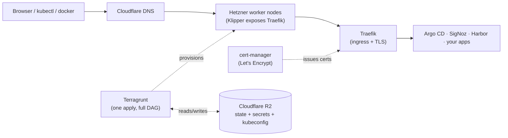

# Welcome

**hetzner-kube-express** is the shortcut from zero to a solid Kubernetes platform on [Hetzner Cloud](https://www.hetzner.com/cloud): one `terragrunt run --all apply` gets you a batteries-included cluster with ingress, observability, storage, cert-manager, gitops, postgres operator, and container registry.

## What you get

A single `terragrunt run --all apply` from an environment folder provisions the cluster, wires DNS, requests TLS certificates, and installs the bundled services. State and secrets stay in R2, so a fresh clone can pick up where the last apply left off.

## What's bundled

-   :material-router-network: __[Traefik](https://traefik.io/)__

    ---

    Ingress controller. Routes hostnames to in-cluster services and terminates TLS.

-   :material-certificate: __[cert-manager](https://cert-manager.io/)__

    ---

    Automatic Let's Encrypt certificates via HTTP-01 through Traefik.

-   :material-rocket-launch: __[Argo CD](https://argo-cd.readthedocs.io/)__

    ---

    GitOps controller, exposed via a Traefik Ingress.

-   :material-database: __[CloudNativePG](https://cloudnative-pg.io/)__

    ---

    PostgreSQL operator, ready for declarative DB clusters.

-   :material-package-variant: __[Harbor](https://goharbor.io/)__

    ---

    Container registry with bundled Trivy image scanning, exposed via a Traefik Ingress.

-   :material-chart-line: __[SigNoz](https://signoz.io/)__

    ---

    Observability stack with auto-instrumented Kubernetes metrics and auto-imported dashboards.

## Built on top of

-   :material-kubernetes: __[k3s](https://k3s.io/)__ via [kube-hetzner](https://github.com/kube-hetzner/terraform-hcloud-kube-hetzner)

    ---

    Lightweight Kubernetes distribution provisioned on Hetzner `cx23` nodes in `fsn1`.

-   :material-lan: __[Cilium](https://cilium.io/) + [Hubble](https://docs.cilium.io/en/stable/observability/hubble/)__

    ---

    CNI with kube-proxy replacement; Hubble adds in-cluster network observability.

-   :material-cloud-outline: __[Klipper](https://klipper.sh/)__

    ---

    k3s ServiceLB; exposes Traefik on every node's public IP so no paid Hetzner LB is needed.

-   :material-cloud-lock: __[Cloudflare R2](https://developers.cloudflare.com/r2/)__

    ---

    S3-compatible storage for Terraform state and per-env `secrets.json` (one bucket, both jobs).

-   :material-dns: __[Cloudflare DNS](https://developers.cloudflare.com/dns/)__

    ---

    A records wired automatically to the cluster's worker node pool.

-   :material-graph: __[Terragrunt](https://terragrunt.gruntwork.io/)__

    ---

    Orchestrates the Terraform units as a dependency graph, one apply across the whole stack.

## Cost shape

The default dev environment runs on a handful of cx23 nodes for less than $20/month. Most managed Kubernetes services charge ~$70/month just to keep the control plane running — before a single workload.

## Special thanks

Huge thanks to the [kube-hetzner](https://github.com/kube-hetzner/terraform-hcloud-kube-hetzner) maintainers. Their Terraform module does the heavy lifting — k3s on Hetzner, Cilium, Traefik, Klipper, cert-manager — and this project is largely a thin opinionated wrapper around it. If you find this useful, consider starring or sponsoring their repo.

## Where to next

[:material-arrow-right: Get started](getting-started.md){ .md-button .md-button--primary }
[:material-book-open-page-variant: User guide](how-it-fits-together.md){ .md-button }
[:material-account-multiple: Join as a teammate](joining.md){ .md-button }

- Want the high-level map first? Read [How it fits together](how-it-fits-together.md) for the Terragrunt graph, module wiring, and R2 mental model.
- New cluster? Head to [Getting started](getting-started.md) for the one-time setup as cluster owner.
- Onboarding onto an existing cluster? See [Joining as a teammate](joining.md).
- Sending a PR? See [Contributing](contributing.md) for the repo layout, conventions, and Cursor skills setup.
