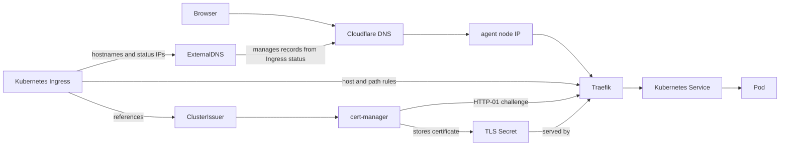

# Bundled ingress

The stack includes a ready-to-use ingress path for web UIs and applications. You get Traefik, cert-manager, Klipper ServiceLB, and ExternalDNS working with Cloudflare DNS without a paid Hetzner load balancer.

## How traffic reaches the cluster

Cloudflare DNS points each Ingress hostname at the public IPs of the agent nodes. Klipper exposes Traefik on those nodes, and Traefik routes requests to Kubernetes `Ingress` objects inside the cluster.

The path looks like this:



The `Ingress` contains the host and routing rules for Traefik. It also references a cert-manager `ClusterIssuer`, which tells cert-manager how to request certificates. cert-manager completes Let's Encrypt HTTP-01 challenges through Traefik and stores the issued certificate in a Kubernetes TLS Secret that Traefik serves for HTTPS.

## What is configured for you

Bundled services such as Argo CD, SigNoz, and Harbor create Traefik `Ingress` objects when they are enabled. Their hostnames, enablement flags, and related environment settings live in `infra/<env>/env.hcl`.

The `external-dns` unit watches those Ingresses and creates Cloudflare `A` records for their hostnames. It creates one record per hostname and agent node IP, which gives simple DNS round-robin across the agents.

For unproxied records, Cloudflare returns all `A` records for the hostname, but in random order. Cloudflare also documents this setup as [round-robin DNS](https://developers.cloudflare.com/dns/manage-dns-records/how-to/round-robin-dns/), so clients that always try the first returned address should still spread out naturally as DNS responses rotate.

This is simple load sharing, not a managed load balancer. DNS and client caches can make traffic uneven, and plain round-robin DNS does not check whether an agent is healthy.

## Adding your own app

For an application, expose it with a normal Kubernetes `Service` and a Traefik `Ingress`. Prefer an in-cluster `ClusterIP` service behind Traefik instead of creating a new `LoadBalancer` or `NodePort`.

If the hostname should be managed by ExternalDNS, put it on the app's `Ingress`:

```yaml
apiVersion: networking.k8s.io/v1
kind: Ingress
metadata:
  name: app
  namespace: app
spec:
  ingressClassName: traefik
  rules:
    - host: app.example.com
      http:
        paths:
          - path: /
            pathType: Prefix
            backend:
              service:
                name: app
                port:
                  number: 80
```

ExternalDNS creates the DNS record from the Ingress hostname and status IPs. If TLS is enabled, put the same hostname in `spec.tls[].hosts` so cert-manager requests a certificate for it.

The application `Deployment`, `Service`, and `Ingress` can live in Kubernetes directly or in your GitOps workflow. ExternalDNS only manages the Cloudflare records.

## Node pool changes and DNS

If you run a full environment apply, Terragrunt applies the cluster first and keeps ExternalDNS running before the bundled service Ingresses are created:

```bash
cd infra/<env>
terragrunt run --all apply
```

That means scaling agents, adding an ingress-capable agent pool, or removing one is normally enough. Kubernetes updates the Ingress addresses, and ExternalDNS reconciles Cloudflare from those addresses.

!!! tip "Only labeled agents receive ingress traffic"
    Agent node pools that should expose Traefik need the `svccontroller.k3s.cattle.io/enablelb=true` label. The example environment uses that label so Ingress status, and therefore DNS, contains only agent pool IPs.

## Cloudflare proxy mode

Ingress records are managed with Cloudflare proxying disabled. This is intentional: cert-manager currently uses HTTP-01, and those challenges need to reach Traefik directly.

!!! danger "Do not enable the Cloudflare proxy"
    Flipping `proxied = true` while cert-manager still uses HTTP-01 breaks certificate issuance and renewal. Only enable proxy mode if you also switch the ACME solver to something compatible, such as DNS-01.