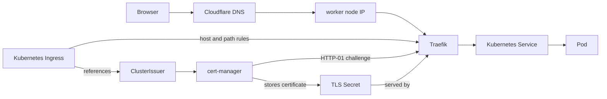

# Bundled ingress

The stack includes a ready-to-use ingress path for web UIs and applications. You get Traefik, cert-manager, Klipper ServiceLB, and Cloudflare DNS working together without a paid Hetzner load balancer.

## How traffic reaches the cluster

Cloudflare DNS points each configured hostname at the public IPs of the worker nodes. Klipper exposes Traefik on those nodes, and Traefik routes requests to Kubernetes `Ingress` objects inside the cluster.

The path looks like this:



The `Ingress` contains the host and routing rules for Traefik. It also references a cert-manager `ClusterIssuer`, which tells cert-manager how to request certificates. cert-manager completes Let's Encrypt HTTP-01 challenges through Traefik and stores the issued certificate in a Kubernetes TLS Secret that Traefik serves for HTTPS.

## What is configured for you

Bundled services such as Argo CD, SigNoz, and Harbor create Traefik `Ingress` objects when they are enabled. Their hostnames, enablement flags, and related environment settings live in `infra/<env>/env.hcl`.

The `cloudflare-dns` unit creates Cloudflare `A` records for enabled bundled services. It creates one record per hostname and worker node IP, which gives simple DNS round-robin across the workers.

For unproxied records, Cloudflare returns all `A` records for the hostname, but in random order. Cloudflare also documents this setup as [round-robin DNS](https://developers.cloudflare.com/dns/manage-dns-records/how-to/round-robin-dns/), so clients that always try the first returned address should still spread out naturally as DNS responses rotate.

This is simple load sharing, not a managed load balancer. DNS and client caches can make traffic uneven, and plain round-robin DNS does not check whether a worker is healthy.

## Adding your own app

For an application, expose it with a normal Kubernetes `Service` and a Traefik `Ingress`. Prefer an in-cluster `ClusterIP` service behind Traefik instead of creating a new `LoadBalancer` or `NodePort`.

If the hostname should be managed by Terraform, add its subdomain to `cloudflare.additional_ingress_subdomains` in `infra/<env>/env.hcl`:

```hcl
cloudflare = {
  zone_id = "<cloudflare-zone-id>"
  domain  = "<example.com>"

  additional_ingress_subdomains = [
    "app",
  ]
}
```

The `cloudflare-dns` unit expands each subdomain under `cloudflare.domain` and creates `A` records pointing at the current worker node public IPs. Your Kubernetes `Ingress` should use the resulting hostname, such as `app.example.com`, in `spec.rules[].host` and, when TLS is enabled, in `spec.tls[].hosts`.

After changing only app DNS settings, apply the DNS unit:

```bash
cd infra/<env>/cloudflare-dns
terragrunt apply
```

This only creates DNS records. The application `Deployment`, `Service`, and `Ingress` still live in Kubernetes or your GitOps workflow.

## Node pool changes and DNS

If you run a full environment apply, Terragrunt applies the cluster first and then updates Cloudflare DNS from the cluster's current worker node IPs:

```bash
cd infra/<env>
terragrunt run --all apply
```

That means scaling workers, adding an ordinary worker pool, or removing one is normally enough. The DNS records are reconciled as part of the same run.

If you apply only the cluster unit after changing node pools, also apply `cloudflare-dns` afterwards:

```bash
cd infra/<env>/cluster
terragrunt apply

cd ../cloudflare-dns
terragrunt apply
```

Without the second apply, Cloudflare may still point at the old set of worker IPs until the DNS unit is reconciled.

## Cloudflare proxy mode

Ingress records are managed with Cloudflare proxying disabled. This is intentional: cert-manager currently uses HTTP-01, and those challenges need to reach Traefik directly.

Do not enable the Cloudflare proxy for these records unless you also change the certificate flow to something compatible, such as DNS-01.