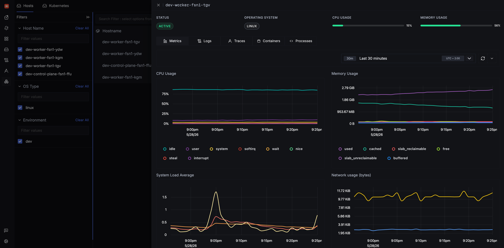

# SigNoz

SigNoz is the bundled observability stack. In the provided environment it is enabled by default, so a normal `terragrunt run --all apply` installs the SigNoz chart, the Kubernetes infrastructure integration, a Traefik Ingress, and the dashboard importer.




## Configure or disable it

SigNoz is configured from `infra/<env>/env.hcl`. That is where you control whether it is enabled, which hostname it uses, chart versions, and the size of its persistent volumes.

To skip SigNoz in a new environment, set the SigNoz `enabled` flag to `false` before the first apply:

```hcl
signoz = {
  enabled = false
}
```

If SigNoz is already installed, destroy the `signoz` unit before flipping the flag. Once `enabled = false`, Terragrunt excludes that unit from future runs.

!!! warning
    Destroying the `signoz` unit deletes the SigNoz namespace and its [persistent volumes](persistent-volumes.md). Any telemetry stored in SigNoz is lost unless you have backed it up elsewhere.

## Resize the persistent volumes

SigNoz keeps state on three PersistentVolumeClaims. Their sizes are exposed in `infra/<env>/env.hcl` so each environment can tune capacity without forking the module.

| PVC | Purpose |
| --- | --- |
| `clickhouse` | Telemetry data (traces, metrics, logs). The only PVC that grows with usage. |
| `zookeeper` | ClickHouse coordination state. |
| `signoz` | Internal SQLite database for dashboards, users, and alerts. |

Hetzner block storage is grow-only and has a 10 GiB minimum per volume, so values below 10 GiB are silently rounded up at provision time. Start small if in doubt; see [Persistent Volumes](persistent-volumes.md) for the storage class details and operational caveats.

## Access the UI

The UI is exposed through Traefik at the SigNoz host configured in `env.hcl`.

The initial user email comes from the environment's operator email. The initial password is generated during apply and stored in the `signoz-initial-admin-secret` Kubernetes Secret:

```bash
kubectl -n signoz get secret signoz-initial-admin-secret \
  -o jsonpath='{.data.email}' | base64 -d; echo
```

```bash
kubectl -n signoz get secret signoz-initial-admin-secret \
  -o jsonpath='{.data.password}' | base64 -d; echo
```

After the first login, change the password in the SigNoz UI. The dashboard importer uses its own service-account key, so changing the admin password later should not break future applies.

## Resource expectations

SigNoz is useful, but it is not tiny. On small Hetzner nodes such as `cx22` or `cx23`, ClickHouse and the collector can be memory hungry.

If SigNoz pods start getting OOMKilled, first consider adding worker capacity in `agent_nodepools` for that environment. Tune Helm resource values only once you know which component is actually constrained.

## Send application telemetry

Applications running inside the cluster can send OpenTelemetry data to the bundled collector service.

For OTLP/HTTP:

```text
http://signoz-otel-collector.signoz.svc.cluster.local:4318
```

For OTLP/gRPC:

```text
signoz-otel-collector.signoz.svc.cluster.local:4317
```

These are in-cluster service endpoints. They are intentionally plain HTTP / gRPC, so most clients need insecure or no-TLS mode enabled.

A typical OTLP/HTTP setup looks like:

```bash
OTEL_EXPORTER_OTLP_ENDPOINT=http://signoz-otel-collector.signoz.svc.cluster.local:4318
OTEL_EXPORTER_OTLP_PROTOCOL=http/protobuf
```

For gRPC clients, use the gRPC host:port endpoint and enable the SDK's insecure option.

## What is collected

The bundled Kubernetes integration collects cluster infrastructure signals: host metrics, kubelet metrics, cluster metrics, Kubernetes events, logs, Kubernetes attributes, and Prometheus-style annotated targets.

That means workloads using common `prometheus.io/*` scrape annotations should be picked up without rewriting them specifically for SigNoz.

## Bundled dashboards

Dashboard JSON files live in `infra/modules/signoz/dashboards/`. Terraform mounts them into the cluster and runs a post-install import Job after SigNoz is available.

The bundled dashboards are mostly examples and starting points. They are useful for seeing how SigNoz dashboard JSON is structured and how cluster queries are put together.

For day-to-day cluster exploration, start with SigNoz's **Infrastructure** tab. It is usually better for understanding nodes, pods, logs, events, and resource pressure than jumping straight into the imported dashboards.

